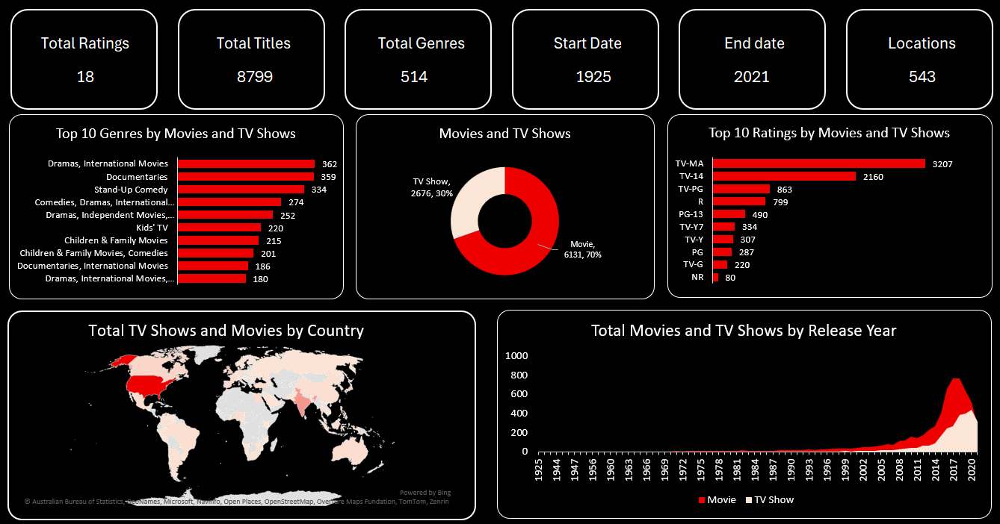

# Netflix Excel Dashboard 📊

This project is a static Excel dashboard analyzing 8,799 Netflix titles released between 1925 and 2021. It includes insights by genre, content type (Movie/TV), country, and ratings.

## 📌 Key Features
- Total Titles, Ratings, and Genres
- Top 10 Genres and Ratings
- Movie vs TV Show Distribution
- Country-wise Content Map
- Release Year Trends (1925–2021)

## 🛠 Tools Used
- Microsoft Excel
- Pivot Charts
- Pivot Tables
- Conditional Formatting
- Custom Layout & Theming

## 📷 Dashboard Preview

## 📁 Files
- `netflix_titles_dashboard.xlsx`: The main dashboard file
- `Dashboard.png`: Screenshot preview

---

Feel free to explore or suggest improvements
